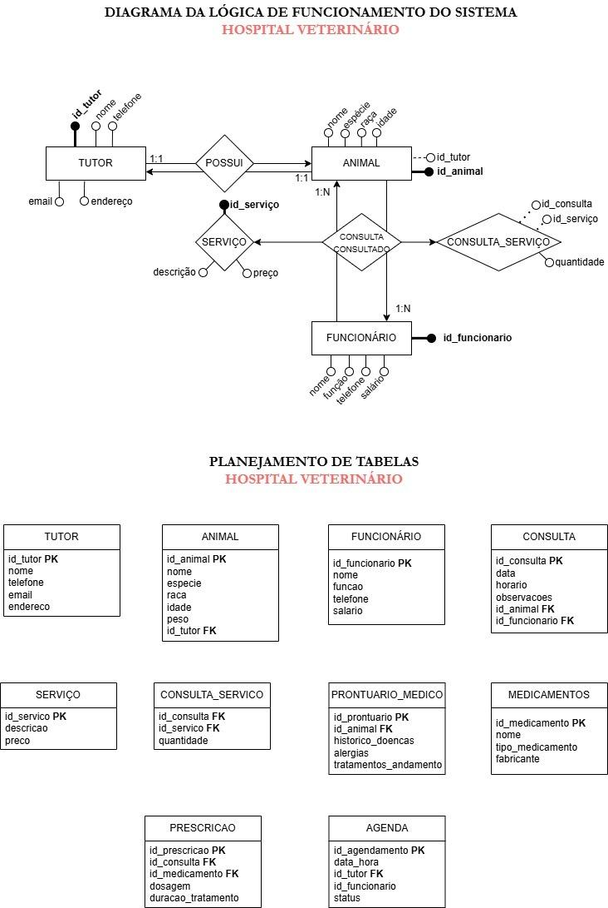

# 🐾 Database System for a Veterinary Hospital - UFU Final Project (2025)

🧑🏽‍💻 This repository hosts my final project for the **Database Systems** course offered by the **Federal University of Uberlândia (UFU)** during the 2024/2 semester, completed in 2025.

---

## 💡 About the Project

The objective of the final project was to develop a **Database System** simulating a real-world establishment where data registration and management are essential for maintaining business operations.

My proposal was to create a **Veterinary Hospital Management System**, designed to store and organize information required for efficient patient care.

The system consists of **10 tables**, including:

- **Pet owners** registration
- **Animals** information
- **Veterinary hospital employees** information
- **Medications** prescribed to patients

To support hospital operations, the following service-related tables were also created:

- **Appointments** scheduling
- **Animal consultations**
- **Medical records**
- **Services performed** at the hospital
- **Prescriptions** for medications and services
- **Consultation-service relationship** records

---

## 🛠️ Technologies Used

- PostgreSQL
- pgAdmin 4
- [Draw.io](https://app.diagrams.net/) (System planning and diagram design)
- GitHub

---

## 📂 Repository Structure

- `/sql/`: SQL scripts for creating and managing the Veterinary Hospital database
- `/diagram/`: Logic and planning diagrams
- `/assets/`: Images used in the README file
- `README.md`: This file

---

## 💭 Planning Phase

Before implementing the database, I used **Draw.io** to design the Veterinary Hospital workflow and plan all the necessary tables for the project.



---

## 🧑🏽‍💻 CREATING THE SQL SCRIPT

The project begins with the creation of a schema called **"sistema"** to organize the database structure, especially the IDs and their sequences:

```sql
-- CREATING THE SCHEMA AND SEQUENCES TO AUTOMATE ID GENERATION

CREATE SCHEMA sistema;

CREATE SEQUENCE sistema.tb_tutores_id_seq START 1;
CREATE SEQUENCE sistema.tb_animais_id_seq START 1;
CREATE SEQUENCE sistema.tb_funcionarios_id_seq START 1;
.
.
.
    Other sequences...
```

After creating the schema and sequences, the database tables were created:

```sql
-- CREATING THE VETERINARY HOSPITAL DATABASE TABLES

CREATE TABLE sistema.tutores
(
    id_tutor    INTEGER         PRIMARY KEY             DEFAULT nextval('sistema.tb_tutores_id_seq'),
    nome        VARCHAR(32)     CONSTRAINT nn_nome      NOT NULL,
    telefone    VARCHAR(20)     CONSTRAINT nn_telefone  NOT NULL,
    email       VARCHAR(32)     CONSTRAINT nn_email     NOT NULL,
    endereco    VARCHAR(32)     CONSTRAINT nn_endereco  NOT NULL
);
.
.
.
    Other tables...
```

After creating the tables, the next step was populating them with sample data.

To create realistic scenarios, I asked ChatGPT to generate veterinary hospital service situations and then implemented them in the database.

### Example Scenario

> "The pet owner Paulo brought his turtle Tuca to the veterinary hospital after noticing a crack in its shell. Dr. Renata examined the turtle and recommended cleaning, healing ointment, and observation. A wound care service was performed and topical medications were prescribed."

```sql
INSERT INTO sistema.tutores (nome, telefone, email, endereco)
VALUES ('Paulo Henrique da Mata', '(62)91234-5566', 'paulo.h.mata@gmail.com', 'Rua das Águas, 99 - Centro');

INSERT INTO sistema.animais (nome, especie, raca, idade, peso, id_tutor)
VALUES ('Tuca', 'Reptile', 'Red-eared Slider Turtle', 5, 2,
       (SELECT id_tutor FROM sistema.tutores WHERE nome = 'Paulo Henrique da Mata'));

INSERT INTO sistema.funcionarios (nome, funcao, telefone, salario)
VALUES ('Renata Oliveira Santos', 'Wildlife Veterinarian', '(62)99876-3344', 'R$ 7,500.00');

.
.
.
    Additional inserts...
```

Finally, several SQL queries were implemented to provide useful information for veterinary hospital staff.

Example:

```sql
-- Display animal name, owner, attending professional,
-- appointment date and time, observations,
-- service description, and quantity

SELECT
    a.nome AS nome_animal,
    t.nome AS tutor,
    f.nome AS profissional_atendente,
    c.data_horario,
    c.observacoes,
    s.descricao AS servico,
    cs.quantidade
FROM sistema.consulta c
JOIN sistema.animais a ON c.id_animal = a.id_animal
JOIN sistema.tutores t ON a.id_tutor = t.id_tutor
JOIN sistema.funcionarios f ON c.id_funcionario = f.id_funcionario
JOIN sistema.consulta_servico cs ON c.id_consulta = cs.id_consulta
JOIN sistema.servico s ON cs.id_servico = s.id_servico
ORDER BY c.data_horario DESC NULLS LAST;
```

---

## 🫵 Project Challenges

During the project presentation, the professor proposed three challenges to evaluate the database system:

### 1. Create a Temporary View Using JOINs

```sql
SELECT
    ag.data_hora,
    t.nome AS tutor,
    f.nome AS profissional,
    ag.status
FROM sistema.agenda ag
JOIN sistema.tutores t ON ag.id_tutor = t.id_tutor
JOIN sistema.funcionarios f ON ag.id_funcionario = f.id_funcionario
ORDER BY ag.data_hora;
```

### 2. Create Triggers to Monitor UPDATE Operations

```sql
CREATE TABLE sistema.dia_consultas (
data_hr VARCHAR NOT NULL,
consultas_qt NUMERIC);

CREATE TABLE sistema.dia_consulta_controle(
operacao CHAR NOT NULL,
usuario VARCHAR NOT NULL,
dt_hr TIMESTAMP NOT NULL,
data_hr VARCHAR NOT NULL,
consultas_qt NUMERIC);

CREATE OR REPLACE FUNCTION sistema.fn_dia_consulta_controle()
RETURNS trigger AS
$$
BEGIN
    IF(tg_op = 'UPDATE') THEN
        INSERT INTO sistema.dia_consulta_controle
        SELECT 'A', user, now(), NEW.*;
        RETURN NEW;
    END IF;
    RETURN NULL;
END
$$
LANGUAGE plpgsql;
```

### 3. Create a Stored Procedure That Returns the Inserted ID

```sql
CREATE OR REPLACE FUNCTION sistema.fn_return_insertedid(
    p_nome VARCHAR,
    p_telefone VARCHAR,
    p_email VARCHAR,
    p_endereco VARCHAR
) RETURNS INTEGER AS
$$
DECLARE
    t_id sistema.tutores.id_tutor%TYPE;
BEGIN
    INSERT INTO sistema.tutores (nome, telefone, email, endereco)
    VALUES (p_nome, p_telefone, p_email, p_endereco)
    RETURNING id_tutor INTO t_id;

    RETURN t_id;
END;
$$
LANGUAGE plpgsql;
```

Example execution:

```sql
SELECT sistema.fn_return_insertedid(
    'Rafinha Santos',
    '(11) 98765-4321',
    'rafinha@logomail.com',
    'Rua das Flores, 123'
);
```

---

## 📌 Conclusion

This project provided me with essential hands-on experience in designing, creating, and managing relational databases. Simulating a real Veterinary Hospital Management System required careful attention to data organization, referential integrity, and efficient information retrieval.

As a future goal, I plan to develop a graphical user interface for this project, transforming it into a complete management system. 😊

<p align="center">
  
</p>

---

## 👤 About the Author

Developed by **Vitor Henrique Carvalho de Morais**, a Computer Engineering student at the **Federal University of Uberlândia (UFU)**.

- 💼 Portfolio: https://vhcdev.netlify.app/
- 🐙 GitHub: https://github.com/Vhcmorais
- ✉️ vhcmdev@gmail.com

Feel free to explore the repository, leave suggestions, or get in touch! 🚀
